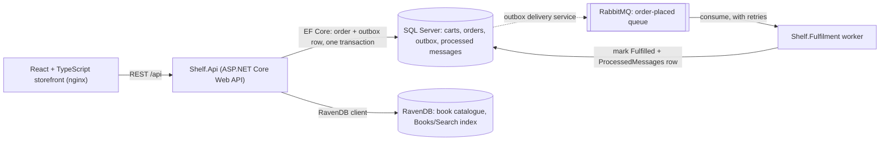
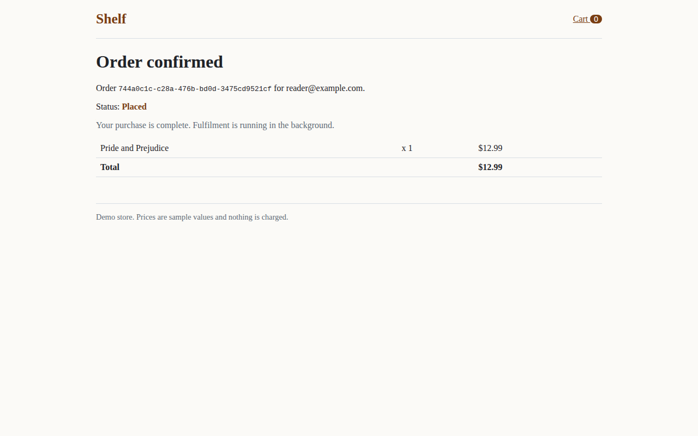

# Shelf


Shelf is a small bookstore: a catalogue with search, a cart and a checkout. The backend is C# on ASP.NET Core Web
API. The book catalogue lives in RavenDB, carts and orders live in SQL Server through Entity Framework Core, and
checkout hands the order to a separate fulfilment worker through an `OrderPlaced` event on RabbitMQ, sent with
MassTransit's transactional outbox. The storefront is React + TypeScript. The whole stack is one compose file, and
GitHub Actions runs unit, integration and Playwright end-to-end tests, two failure scenarios against the full stack,
and mutation testing on every push.

## Architecture



| Project | What it is |
| --- | --- |
| `src/Shelf.Api` | Web API with controllers: `GET /api/books` (optional `?q=` search), `GET /api/books/{slug}`, `GET /api/cart`, `POST /api/cart/items`, `DELETE /api/cart/items/{bookId}`, `POST /api/checkout`, `GET /api/orders/{id}`, and `/health` |
| `src/Shelf.Core` | EF Core model (`ShelfDbContext`), committed migrations, and the pure checkout rules (`CartPricing`, `CheckoutValidator`, `OrderFactory`) |
| `src/Shelf.Contracts` | The `OrderPlaced` message and the queue name, shared by the API and the worker |
| `src/Shelf.Fulfilment` | .NET worker service: `OrderPlacedConsumer`, its retry policy, and the idempotent `OrderFulfilment` handler |
| `src/Shelf.Web` | React + TypeScript storefront built with Vite, served by nginx, which also proxies `/api` |
| `tests/Shelf.UnitTests` | NUnit unit tests |
| `tests/Shelf.IntegrationTests` | NUnit integration tests against real SQL Server and RavenDB containers started by Testcontainers |
| `e2e` | Playwright end-to-end tests and the failure-scenario script (`cold-start-check.sh`), both against the full compose stack |

## How checkout works

1. The browser keeps a random cart id in localStorage and sends it as the `X-Cart-Id` header.
2. `POST /api/cart/items` stores the book id and quantity in SQL Server. The cart never stores prices.
3. `POST /api/checkout` loads the cart, fetches its books from RavenDB in one call, and validates it (non-empty,
   quantities 1 to 10, every book still in the catalogue, a plausible email). Problems come back as a 400 with
   every error listed.
4. It builds the order with the catalogue's current titles and prices copied onto the order lines, removes the cart
   items, and publishes `OrderPlaced`. With the outbox, that publish only adds a row to the same `DbContext`.
5. One transaction commits the order, its lines, the emptied cart and the outbox row. The API returns
   `201 Created` with status `Placed`. The purchase is done at this point.
6. The API's outbox delivery service sends the event to RabbitMQ. The fulfilment worker consumes it, does its
   (simulated, 2 seconds) work, and marks the order `Fulfilled`. The confirmation page polls the order and shows the
   status change.

## See it run

Every CI run records the browser tests: a video and a trace per test, and a screenshot after each named step. They
are uploaded as the `playwright-report` and `playwright-demo` artifacts of each run and kept for 90 days. A copy of
the screenshots and the checkout video from one green run is committed in [`docs/demo`](docs/demo):

From CI run [36779371704](https://github.com/Aeripsen/shelf/actions/runs/36779371704) on 2026-09-30 (commit 1afdafa):

| Step | Screenshot |
| --- | --- |
| Catalogue served from RavenDB | [checkout-1](docs/demo/checkout-1-catalogue-from-ravendb.png) |
| Added to cart | [checkout-2](docs/demo/checkout-2-added-to-cart.png) |
| Cart priced from the catalogue | [checkout-3](docs/demo/checkout-3-cart-priced-from-the-catalogue.png) |
| Order confirmed, status Placed | [checkout-4](docs/demo/checkout-4-order-placed.png) |
| Same order, Fulfilled by the worker | [checkout-5](docs/demo/checkout-5-order-fulfilled-by-the-worker.png) |
| Two books in the cart, then one removed | [cart-1](docs/demo/cart-1-two-books-in-the-cart.png), [cart-2](docs/demo/cart-2-line-removed.png) |
| Search by author through the RavenDB index | [search-1](docs/demo/search-1-search-for-bronte.png) |



The whole checkout test as a video: [docs/demo/checkout.webm](docs/demo/checkout.webm). Its Playwright trace, with
every action, network call and DOM snapshot: [docs/demo/checkout-trace.zip](docs/demo/checkout-trace.zip); open it
with `npx playwright show-trace docs/demo/checkout-trace.zip`, or drop the file on https://trace.playwright.dev.
Every new CI run produces the same files again from the committed tests.

## Run it

Needs Docker. On a machine without Docker, open the repo in GitHub Codespaces (Code, then Codespaces): the
`.devcontainer` has Docker, the .NET 8 SDK and Node 22.

```sh
docker compose up --build
```

| What | Where |
| --- | --- |
| Storefront | http://localhost:3000 |
| API and Swagger UI | http://localhost:5080/swagger |
| Health | http://localhost:5080/health |
| RabbitMQ management | http://localhost:15672 (guest / guest) |
| RavenDB Studio | http://localhost:8081 |

The SQL Server password comes from `MSSQL_SA_PASSWORD` (copy `.env.example` to `.env`). Without it, compose uses a
local development default, `Shelf_LocalDev_Only1`, which is only for your own machine.

To run the API or the worker from source instead, start the infrastructure with
`docker compose up -d sqlserver ravendb rabbitmq`, then `dotnet run --project src/Shelf.Fulfilment`,
`dotnet run --project src/Shelf.Api` (port 5080), and `npm run dev` in `src/Shelf.Web` (port 5173, proxies `/api`).
From source both services use the development connection string with the default password. If you set your own
`MSSQL_SA_PASSWORD`, also set `ConnectionStrings__Orders` for both processes to match.

## Tests

| Level | Command | What it covers |
| --- | --- | --- |
| Unit (NUnit) | `dotnet test tests/Shelf.UnitTests` | Pricing in decimal, checkout validation, prices snapshotted from the catalogue, the fulfilment handler being a no-op on redelivery, and the real consumer and retry policy on MassTransit's in-memory test harness (a transient failure is retried with no `Fault` published, and two failures take the configured 1 s plus 5 s before success) |
| Integration (NUnit) | `dotnet test tests/Shelf.IntegrationTests` | The real API in memory (`WebApplicationFactory`) against SQL Server 2022 in a container, with the transactional outbox and its delivery service running and RabbitMQ replaced by MassTransit's in-memory harness. See the list below. The RavenDB catalogue against RavenDB 7.2 in a container |
| Failure scenarios | `docker compose up -d --build sqlserver ravendb rabbitmq api web`, then `bash e2e/cold-start-check.sh` | On a fresh broker, an order placed before the worker has ever started waits in the `order-placed` queue and is fulfilled once the worker starts. Then, with RabbitMQ stopped, checkout still answers `201`, and that order is fulfilled once RabbitMQ is started again |
| Mutation (Stryker.NET) | `dotnet tool restore`, then `dotnet stryker` in `tests/Shelf.UnitTests` | Mutates the worker's handler and consumer (`stryker-config.json`) and runs the unit tests against each mutant, for example removing the `UseMessageRetry` call. CI puts the report in the job summary; it does not fail the build |
| End to end (Playwright) | the stack running with the worker, then `npm ci && npx playwright test` in `e2e` | A real browser against the full stack: browse, add to cart, check out, see Placed then Fulfilled; add twice and remove a line; search by author; the API's error for an empty cart |

What the integration tests check, in plain words:

- Checkout writes the order and lines with catalogue prices, empties the cart, and the outbox delivers `OrderPlaced`.
  Delivery is observed by a consumer on the in-memory bus, so it counts only what the outbox actually sent.
- A publish whose transaction never commits is never delivered; one that commits is.
- Two checkouts of the same cart at the same moment (held at a barrier so both read the cart first) give exactly one
  `201`, one `409` and one order, and no `OrderPlaced` is ever sent for the checkout that rolled back.
- A commit that succeeds but reports a timeout (injected by an EF Core interceptor) still answers `201` with one
  order, instead of being replayed into a `409`.
- Five concurrent adds to one cart end at quantity 5. Removing a line deletes only that book.
- Price fields sent by a client have no effect. The request types have no price field, so this guards against one
  being added later rather than testing current logic.
- A brand-new database: `/health` is `503` before the migrating start, and every committed migration is applied after
  it.
- On real SQL Server, two copies of one `OrderPlaced` racing past the "already processed?" check leave one
  `ProcessedMessages` row and one status change; the loser is stopped by the primary key and its update rolls back.
- Against a real RavenDB: the seed is repeatable, listing reads the catalogue in pages without missing a book (page
  size 3 over the 10 seeded books), batch loads return only books that exist, the `Books/Search` index finds books by
  title and author word prefixes, and the health check is healthy.

Integration tests need Docker. To use existing servers instead of containers, set `SHELF_TEST_SQL` to a SQL Server
connection string and `SHELF_TEST_RAVEN` to a RavenDB URL.

Latest counts, from CI run [36779371704](https://github.com/Aeripsen/shelf/actions/runs/36779371704) on 2026-09-30
(commit 1afdafa): 33 unit tests, 29 integration tests and 4 Playwright tests, all passing; both failure scenarios
passed; Stryker.NET mutation score 52.94% on the worker (9 mutants killed, 5 survived, 3 not covered by unit tests;
the survivors are two log calls, an exception message, and two mutants that behave like the original: `>= 0` on a
zero delay, and removing the `EndpointName` line, since MassTransit's kebab-case default for `OrderPlacedConsumer` is
also `order-placed`; the uncovered ones are the duplicate-key path, which only the SQL Server integration test
reaches). NUnit counts each `[TestCase]` row as its own test.

## Design notes

**Why a queue between checkout and fulfilment.** A direct call would tie the purchase to fulfilment's speed and
uptime. With RabbitMQ in between, checkout needs RavenDB (for prices) and SQL Server, but not the worker; it returns
`Placed` straight away and the worker catches up. The cost is eventual consistency: the order shows `Placed` for a
moment before `Fulfilled`, and the confirmation page shows exactly that.

**Transactional outbox.** Saving the order and then publishing would be two writes with no shared transaction: a
broker outage between them would leave an order that is never fulfilled. Instead, MassTransit's EF Core bus outbox
turns the publish into an `OutboxMessage` row in the same transaction as the order, and a hosted service in the API
delivers it to RabbitMQ afterwards, retrying while the broker is down. Delivery is at least once (a crash between
sending and marking the row sent resends it), which the worker's idempotency covers. The failure-scenario script
stops RabbitMQ, checks out, starts RabbitMQ again and waits for that order to be fulfilled, on every CI run. One
trap found on the way: MassTransit's test harness removes the app's MassTransit registrations, the outbox included,
so `OutboxRegistration.AddShelfOutbox` is shared by `Program.cs` and the test factory.

**The queue exists before the worker does.** RabbitMQ drops a message published to an exchange with no queue bound.
The worker's `order-placed` queue normally appears only when the worker first starts, so the API also declares that
queue and binds it to the `OrderPlaced` exchange when its bus starts (`BindQueue` plus `DeployPublishTopology` in
`Program.cs`). It has to happen at startup: the outbox delivery service sends each stored message to its exchange
through a send endpoint, which never applies publish-side bindings (the first CI run of the cold-start check caught
exactly that). The worker's own binding goes through a second exchange; RabbitMQ puts a message in a queue at most
once however many bindings lead there. The cold-start check in CI proves the whole path on a fresh broker.

**A lost commit acknowledgement is not a conflict.** The SQL Server connection retries transient errors. If a commit
reaches the server but the acknowledgement is lost, a blind retry would replay checkout's batch against a cart that is
already empty. Checkout saves through `ExecuteInTransactionAsync` with a `verifySucceeded` callback that looks for the
order before retrying, which is EF Core's documented pattern for commit failures.

**Idempotent handling, and what "once" means.** RabbitMQ and the outbox both deliver at least once, so the same
`OrderPlaced` can arrive twice. The worker keeps a `ProcessedMessages` table keyed by `OrderId`: fulfilling is a
per-order action, so this also catches two different messages for the same order. It checks the table first and does
nothing if the order is there. Otherwise it marks the order `Fulfilled` and inserts the row in the same `SaveChanges`.
If two copies race past the check, the second insert hits the primary key (SQL Server error 2627), its transaction
rolls back, and the worker treats it as already processed. The database change happens once. The simulated work
before it can run in both copies of a race, so a real downstream call would need its own idempotency key (the
`OrderId`).

**Retries and poison messages.** `OrderPlacedConsumerDefinition` retries in memory after 1, 5 and 15 seconds, which
covers transient faults like a deadlock or a timeout. After the last retry MassTransit moves the message to the
`order-placed_error` queue with the exception in its headers, so one bad message cannot block the queue or loop
forever. The policy lives in the definition so the worker and the tests use the same one.

**Prices come from the catalogue.** The client only ever sends a book id and a quantity. Checkout reads prices from
RavenDB and copies them onto the order lines, so a later price change never rewrites a past order and the two stores
never need a distributed transaction.

**RavenDB for the catalogue, SQL Server for orders.** A book is naturally one document that the storefront reads
whole. Orders need transactions and relational integrity: lines belong to an order, totals must add up, and
fulfilment updates status. The full list loads documents by id prefix, 256 per round trip, instead of querying an
index, so it is never stale right after the seed runs; the API returns it in one response. Search uses a static map
index, `Books/Search`, that puts title and author into one full-text field; every word of the query must match as a
word prefix, and only letters and digits from the input reach the query. Indexes update asynchronously, so a search
waits up to five seconds for non-stale results.

**Money is `decimal`, stored as `decimal(10,2)`.** 3 x 12.99 is exactly 38.97 in `decimal` (a unit test checks it),
and an integration test checks that an order total of 33.97 round-trips through SQL Server unchanged.

**Concurrent cart changes.** Cart lines carry a SQL Server `rowversion`. Adding to the cart re-reads and retries when
another request changed the same cart in between, so two quick clicks never lose an addition. Checkout deletes the
cart lines with their rowversion in the `WHERE` clause, so if a line that checkout read was updated or removed in the
meantime, nothing is written and the API answers 409 asking the shopper to review the cart. A different book added at
the same moment is not part of the order; it stays in the cart for the next checkout.

**Health.** `/health` checks that SQL Server accepts a connection, that the RavenDB catalogue database answers, and
(MassTransit's own check) that the bus is connected. It answers 503 when any of them fails. CI waits on it before the
failure scenarios.

**MassTransit 8.** The packages are pinned to 8.5.11. Version 8 is Apache 2.0; version 9 is released under a
commercial license ([announcement](https://masstransit.io/introduction/v9-announcement)). The MassTransit 8.5 EF Core
outbox package requires EF Core 9, which runs on .NET 8, so the solution uses EF Core 9.0.20.

## Limitations

- Adding to the cart is not idempotent. If a write commits but its acknowledgement is lost, the connection's retry can
  count that addition twice. A client-generated idempotency key per add would close this.
- No authentication: carts are keyed by a browser-generated id, and anyone with an order id can read that order.
- No payments. Prices are sample values.
- RavenDB runs as a single unsecured node in development mode. The catalogue API returns the whole list, with no
  paging parameters; it holds 10 books.
- Migrations run when the API starts. With several API instances they should run as a separate deploy step instead.
- The fulfilment "work" is a configurable delay standing in for real downstream calls.
- Swagger UI is on in every environment, because this is a demo service.
- CI builds the Docker images to run them and throws them away; nothing is published to a registry, and nothing is
  deployed. The stack has run on GitHub's ubuntu runners; CI does not exercise the Codespaces dev container.

## License

MIT
