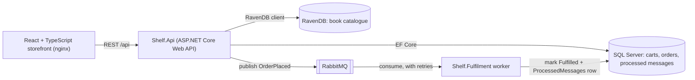

# Shelf


Shelf is a small bookstore: a catalogue, a cart and a checkout. The backend is C# on ASP.NET Core Web API. The book
catalogue lives in RavenDB, carts and orders live in SQL Server through Entity Framework Core, and checkout hands the
order to a separate fulfilment worker by publishing an `OrderPlaced` event on RabbitMQ with MassTransit. The storefront
is React + TypeScript. Everything runs with one `docker compose up`, and GitHub Actions runs unit, integration and
Playwright end-to-end tests and builds the Docker images on every push.

## Architecture



| Project | What it is |
| --- | --- |
| `src/Shelf.Api` | Web API with controllers: `GET /api/books`, `GET /api/books/{slug}`, `GET /api/cart`, `POST /api/cart/items`, `DELETE /api/cart/items/{bookId}`, `POST /api/checkout`, `GET /api/orders/{id}` |
| `src/Shelf.Core` | EF Core model (`ShelfDbContext`), committed migrations, and the pure checkout rules (`CartPricing`, `CheckoutValidator`, `OrderFactory`) |
| `src/Shelf.Contracts` | The `OrderPlaced` message shared by the API and the worker |
| `src/Shelf.Fulfilment` | .NET worker service: `OrderPlacedConsumer`, its retry policy, and the idempotent `OrderFulfilment` handler |
| `src/Shelf.Web` | React + TypeScript storefront built with Vite, served by nginx, which also proxies `/api` |
| `tests/Shelf.UnitTests` | NUnit unit tests |
| `tests/Shelf.IntegrationTests` | NUnit integration tests against a real SQL Server started by Testcontainers |
| `e2e` | Playwright end-to-end tests against the full compose stack |

## How checkout works

1. The browser keeps a random cart id in localStorage and sends it as the `X-Cart-Id` header.
2. `POST /api/cart/items` stores the book id and quantity in SQL Server. The cart never stores prices.
3. `POST /api/checkout` loads the cart, fetches its books from RavenDB in one call, and validates it (non-empty,
   quantities 1 to 10, every book still in the catalogue, a plausible email). Problems come back as a 400 with
   every error listed.
4. It builds the order with the catalogue's current titles and prices copied onto the order lines, removes the cart
   items, and calls `SaveChanges` once, so the order and the emptied cart commit in one transaction.
5. It publishes `OrderPlaced` and returns `201 Created` with status `Placed`. The purchase is done at this point.
6. The fulfilment worker consumes the message, does its (simulated, 2 seconds) work, and marks the order `Fulfilled`.
   The confirmation page polls the order and shows the status change.

## Run it

Needs Docker.

```sh
docker compose up --build
```

| What | Where |
| --- | --- |
| Storefront | http://localhost:3000 |
| API and Swagger UI | http://localhost:5080/swagger |
| RabbitMQ management | http://localhost:15672 (guest / guest) |
| RavenDB Studio | http://localhost:8081 |

The SQL Server password comes from `MSSQL_SA_PASSWORD` (copy `.env.example` to `.env`). Without it, compose uses a
local development default, `Shelf_LocalDev_Only1`, which is only for your own machine.

To run the API or the worker from source instead, start the infrastructure with
`docker compose up -d sqlserver ravendb rabbitmq`, then `dotnet run --project src/Shelf.Api` (port 5080) and
`dotnet run --project src/Shelf.Fulfilment`, and `npm run dev` in `src/Shelf.Web` (port 5173, proxies `/api`).

## Tests

| Level | Command | What it covers |
| --- | --- | --- |
| Unit (NUnit) | `dotnet test tests/Shelf.UnitTests` | Pricing in decimal, checkout validation, prices snapshotted from the catalogue, the fulfilment handler being a no-op on redelivery, and the real consumer and retry policy on MassTransit's in-memory test harness (one transient failure is retried and no `Fault` is published) |
| Integration (NUnit) | `dotnet test tests/Shelf.IntegrationTests` | The real API in memory (`WebApplicationFactory`) against SQL Server 2022 in a container (Testcontainers). The committed migrations are applied, checkout writes the order and lines with catalogue prices, empties the cart and publishes `OrderPlaced`, a price sent by the client is ignored, and two copies of one message racing on real SQL Server fulfil the order exactly once |
| End to end (Playwright) | `docker compose up -d --build`, then `npm ci && npx playwright test` in `e2e` | A real browser against the full stack: browse, add to cart, check out, see the confirmation showing Placed, then watch it turn to Fulfilled when the worker finishes |

Integration tests need Docker. To use an existing SQL Server instead of starting a container, set `SHELF_TEST_SQL` to
its connection string.

Latest counts, from CI run 36770628916 on 2026-09-30 (commit df1a0d0): 30 unit tests, 12 integration tests and 3
Playwright tests, all passing.

## Design notes

**Why a queue between checkout and fulfilment.** A direct call would tie the purchase to fulfilment's speed and
uptime. With RabbitMQ in between, checkout only needs SQL Server and the broker; it returns `Placed` straight away
and the worker catches up. If the worker is down, the message waits in its durable queue. The cost is eventual
consistency: the order shows `Placed` for a moment before `Fulfilled`, and the confirmation page shows exactly that.

**Idempotent handling.** RabbitMQ delivers at least once, so the same `OrderPlaced` can arrive twice. The worker keeps
a `ProcessedMessages` table keyed by `OrderId`. It checks the table first and does nothing if the order is there.
Otherwise it marks the order `Fulfilled` and inserts the row in the same `SaveChanges`, which is one transaction. If
two copies race past the check, the second insert hits the primary key (SQL Server error 2627), its transaction rolls
back, and the worker treats it as already processed. The integration tests force exactly that race.

**Retries and poison messages.** `OrderPlacedConsumerDefinition` retries in memory after 1, 5 and 15 seconds, which
covers transient faults like a deadlock or a timeout. After the last retry MassTransit moves the message to the
`order-placed_error` queue with the exception in its headers, so one bad message cannot block the queue or loop
forever. The policy lives in the definition so the worker and the tests use the same one.

**Prices come from the catalogue.** The client only ever sends a book id and a quantity. Checkout reads prices from
RavenDB and copies them onto the order lines, so a later price change never rewrites a past order and the two stores
never need a distributed transaction.

**Why RavenDB for the catalogue and SQL Server for orders.** A book is naturally one document that the storefront
reads whole. Orders need transactions and relational integrity: lines belong to an order, totals must add up, and
fulfilment updates status. The catalogue list loads documents by id prefix instead of querying an index, so it is never
stale right after the seed runs.

**Money is `decimal`, stored as `decimal(10,2)`.** 3 x 12.99 is exactly 38.97, and the integration tests check the
value round-trips through SQL Server unchanged.

## Limitations

- **Dual write.** Checkout commits to SQL Server and then publishes to RabbitMQ. If the broker is unreachable between
  the two, the order is saved as `Placed` but never published, and the API returns an error. The standard fix is a
  transactional outbox (MassTransit has one for EF Core), which is the next step.
- No authentication: carts are keyed by a browser-generated id, and anyone with an order id can read that order.
- No payments. Prices are sample values.
- RavenDB runs as a single unsecured node in development mode.
- Migrations run when the API starts. With several API instances they should run as a separate deploy step instead.
- The fulfilment "work" is a configurable delay standing in for real downstream calls.

## License

MIT
